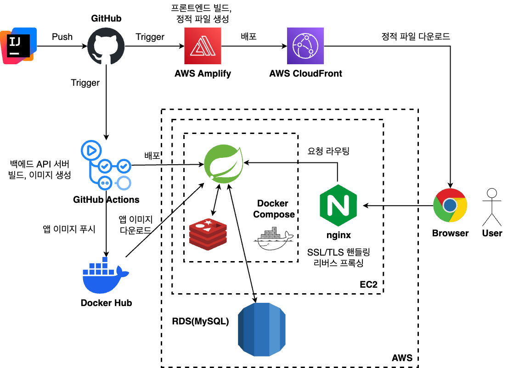
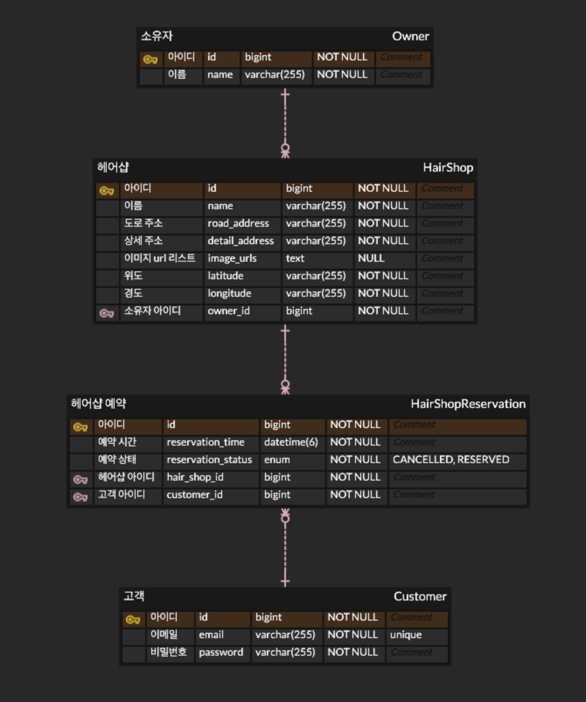

# map-reservation
- 네이버맵을 모티브로 삼은 예약 애플리케이션
- 네이버맵과 같이 맵 화면에서 상점을 검색하고 원하는 상점에서 서비스를 예약
- 현재는 헤어샵 검색과 헤어샵 예약만 가능
- 추후 다른 종류의 상점(음식점 등) 추가 예정
## 사용 기술 및 개발 환경
- Java, Spring Boot, MySQL, Spring Data JPA, QueryDsl
- TypeScript, Nextjs, TanStack Query, Jotai
- EC2, GitHub Actions, AWS Amplify
- 배포: https://map-reservation.oldrabbit.info
## 전체적인 구조

## ERD

